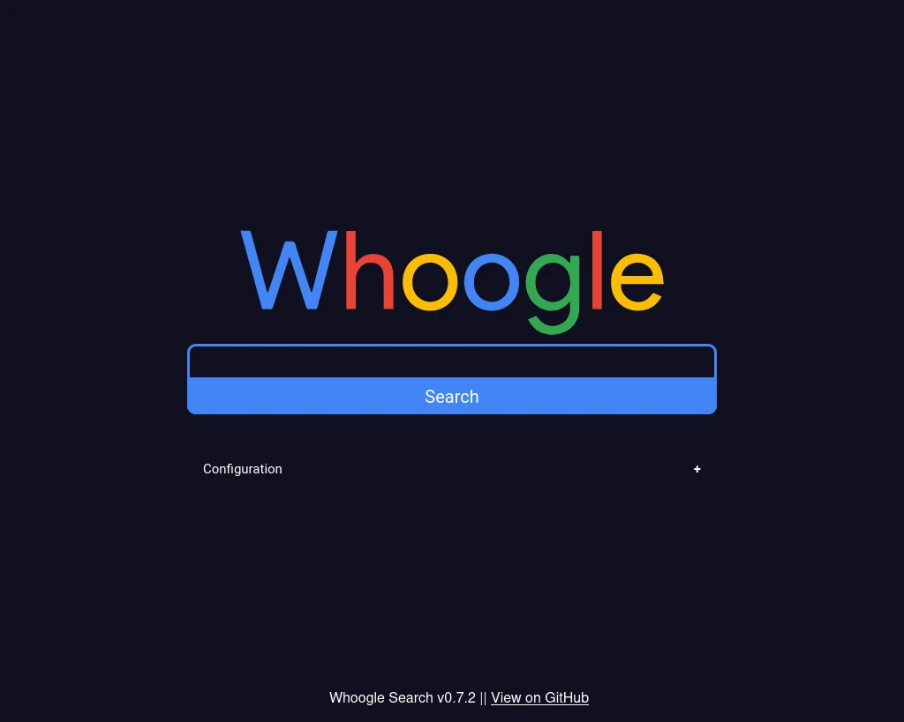

<!--
NB: Deze README is automatisch gegenereerd door <https://github.com/YunoHost/apps/tree/master/tools/readme_generator>
Hij mag NIET handmatig aangepast worden.
-->

# Whoogle voor Yunohost

[](https://ci-apps.yunohost.org/ci/apps/whoogle/)


[](https://install-app.yunohost.org/?app=whoogle)

*[Deze README in een andere taal lezen.](./ALL_README.md)*

> *Met dit pakket kun je Whoogle snel en eenvoudig op een YunoHost-server installeren.*  
> *Als je nog geen YunoHost hebt, lees dan [de installatiehandleiding](https://yunohost.org/install), om te zien hoe je 'm installeert.*

## Overzicht

Get Google search results, but without any ads, JavaScript, AMP links, cookies, or IP address tracking. Easily deployable in one click as a Docker app, and customizable with a single config file. Quick and simple to implement as a primary search engine replacement on both desktop and mobile.

### Features

- No ads or sponsored content
- No JavaScript*
- No cookies**
- No tracking/linking of your personal IP address***
- No AMP links
- No URL tracking tags (i.e. utm=%s)
- No referrer header
- Tor and HTTP/SOCKS proxy support
- Autocomplete/search suggestions
- POST request search and suggestion queries (when possible)
- View images at full res without site redirect (currently mobile only)
- Light/Dark/System theme modes (with support for custom CSS theming)
- Randomly generated User Agent
- DDG-style bang (i.e. !<tag> <query>) searches
- User-defined custom bangs
- Optional location-based searching (i.e. results near <city>)
- Optional NoJS mode to view search results in a separate window with JavaScript blocked


**Geleverde versie:** 0.9.3~ynh1

## Schermafdrukken



## Documentatie en bronnen

- Upstream app codedepot: <https://github.com/benbusby/whoogle-search>
- YunoHost-store: <https://apps.yunohost.org/app/whoogle>
- Meld een bug: <https://github.com/YunoHost-Apps/whoogle_ynh/issues>

## Ontwikkelaarsinformatie

Stuur je pull request alsjeblieft naar de [`testing`-branch](https://github.com/YunoHost-Apps/whoogle_ynh/tree/testing).

Om de `testing`-branch uit te proberen, ga als volgt te werk:

```bash
sudo yunohost app install https://github.com/YunoHost-Apps/whoogle_ynh/tree/testing --debug
of
sudo yunohost app upgrade whoogle -u https://github.com/YunoHost-Apps/whoogle_ynh/tree/testing --debug
```

**Verdere informatie over app-packaging:** <https://yunohost.org/packaging_apps>
